/!\ [DEPRECATED] /!\

# OSXReleaseAutomation

This project is just a sample of how to do a full xcode automation using Sparkle.

The example won't compile if you aren't setting up your own identity, but everything is setted like if you do it.

## Why automation?

Once an OSX app is ready to be released, we generally have two way to distribute it:

* **Direct distribution:** upload the application on a server to be directly downloaded
* **Mac App Store**: using Apple's release system

In the case of the **direct distribution**, we probably would like to have some auto-update system, in this case, most of the developers are using [**Sparkle**](https://github.com/sparkle-project/Sparkle). Sadly, Apple won't agree if an auto-update system is in our app, and will just be **rejected**.

So, how to manage these cases without changing manually the build settings during each release? How to generate automatically each files necessary for the auto-update? The answer: **XCode Automation**. 

When looking for "Release automation" in google, we can find a lot of links, but most of them are dead, out of date... So, it may be hard to find the right answer.

This repository will introduce one way to do it by regrouping all the steps necessary. Each step can have others way to be handled.

## Step 1: Sparkle automation

This steps will be just resume several links (cf below) which explain how to do it. **I strongly suggest you to read the links** which are more full.

At the end of this one, your project shouldn't compile anymore due to the code sign, we are gonna to fix that in the step 3.

### Why?

Sparkle XCode automation will generate for us:
 
 * appcast.xml -> Ready to be upload
 * The .html release note -> Need to update the release note
 * rnotes.css -> Ready to be upload
 * build.zip -> Ready to be upload

So, we won't need anymore to update these files. Isn't it great?

### How?

A script. A simple ruby script which will make everything. This script is from [CraigWilliams's one](https://github.com/CraigWilliams/appcastautomation). I just customize it a little bit to be more helpful in the next step. The custom one is available in this repot.

### Script configuration

*The following text was highly inspired from GraidWilliams Readme...*

Create a YAML file `config.yml`:

```
build_now:              'YES' 
download_base_url:      'http://www.your_website.com/app_folder/'
appcast_basefolder:     '/users/user_name/desktop/app_name/'  
appcast_xml_name:       'appcast.xml'  
keychain_privkey_name:  'Sparkle Private Key'
css_file_name:          'rnotes.css' 
```

##### Variable explanation:

```
build_now: 
	Will only include this script in the build process if this is set to 'YES'
  The script automatically checks that the build style is 'Release'

download_base_url:      
  Your website url where you will place your updated project

appcast_basefolder:   
  The base file is created for you and a project folder inside that with
  the name of your project and version number. 
    eg  - ProjectName 
          - ProjectName 1.0
                - appcast.xml (contains the '<item>' info)
                - 1.0.html
                - rnotes.css
              - ProjectName 1.0.zip
          - ProjectName 1.1
              - appcast.xml (contains the '<item>' info)
              - 1.1.html
              - rnotes.css
              - ProjectName 1.1.zip


The following files are created for you if they do not already exist.
    appcast_xml_name:
    css_file_name:
    version_number.html

Your archived project file is also copied to the project folder
    AppName 1.1.zip

appcast_xml_name:
  This file holds the results of the script. What is between the '' tags that
  you will copy into your complete appcast.xml file.
  Name to your liking.

keychain_privkey_name:
	Explained after this block
	
css_file_name:
This name will be used to create your css file and the link in the xml file. 
If you change this after these are created make sure also change the xml file 
or if you created the css file first use that name here.

  The css is at the bottom of the script and is in 'flat' form. One liners.
  When written to file it is expanded to standard format for easy editing.
```

#### keychain_privkey_name explanation

[Marc's article](https://web.archive.org/web/20120708050000/http://www.entropy.ch/blog/Developer/2008/09/22/Sparkle-Appcast-Automation-in-Xcode.html) explains everything about why and how to do it. I will just copy the steps to manage it, for the explanation, read the article.

First, generate your private keys using [Sparkle scripts](https://github.com/sparkle-project/Sparkle/blob/master/bin/generate_keys.sh)

Once you have your eys, open your keychain and create a new secure note to save the private one

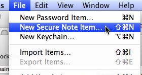

Then the name of copy the private key.

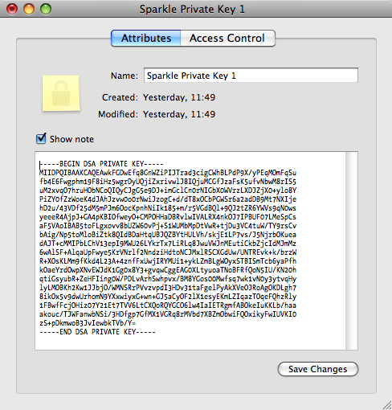


## Step 2: Project configurations

**If you are just doing a direct distribution, you can skip this step and read the third one directly.**

In this step, we are gonna to see how we can have two builds: one for a direct distribution using Sparkle, and one for the mac app store without Sparkle.

#### Why?

Since the mac app store doesn't accept the auto-update system (like Sparkle), we need to remove Sparkle from the Mac App Store build even if we are using it in direct distribution.

In order to avoid having two builds to do for each release, and avoid mistakes when doing it manually, let's have some automation handle it.

### How

* 1 - create a new configuration by duplicating the release one, let's call it `MacAppStore`

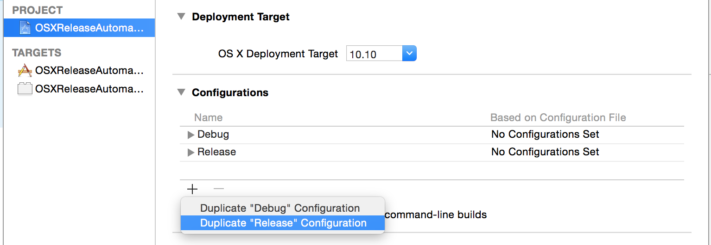

After duplicating:

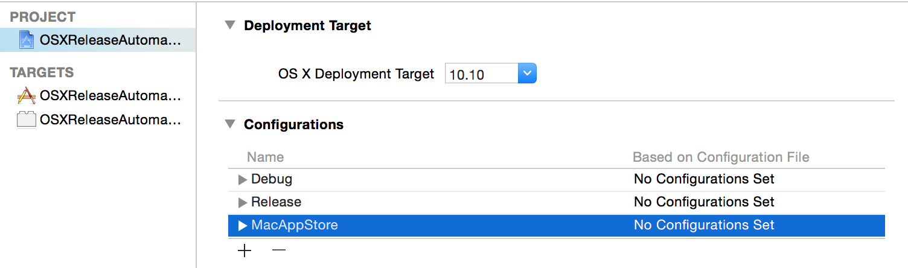

* 2 - update your **Podfile** to handle this new configuration:

```
	pod 'Sparkle', :configurations => ['Debug', 'Release']
```

Now Sparkle will be enable only for the Debug and Release configuration. The MacAppStore one won't have it.

If you aren't using CocoaPods, you just have to remove Sparkle from the MacAppStore build settings.


* 3 - Create a new `C FLag` by adding  `$(OTHER_CFLAGS) -DMacAppStore` in the build settings

```
.xcodeproj -> Target -> Build Settings -> Other C Flags -> + -> `$(OTHER_CFLAGS) -DMacAppStore`
```

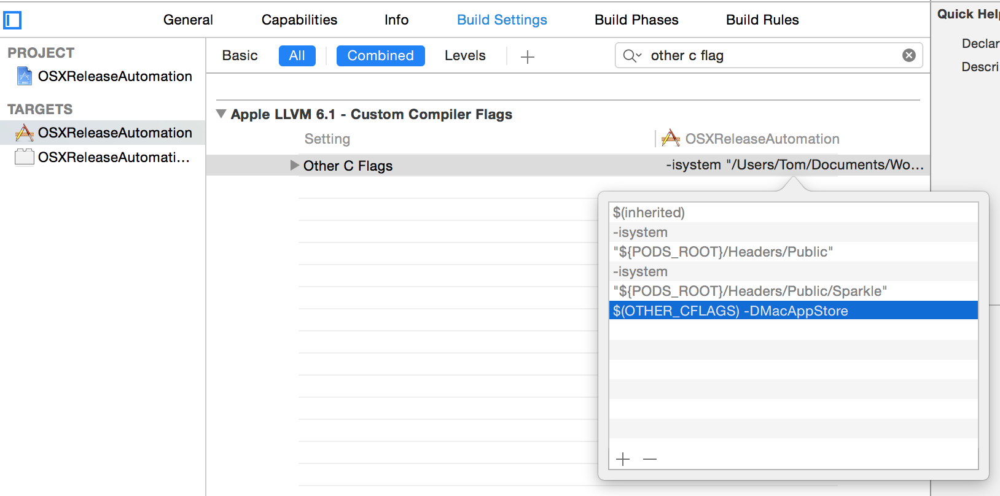

* 4 - Update your UI

From now on, whereever you need to check which configuration is used for special case, you can just handle it:

```
#ifdef MacAppStore
   // Do your stuff
#endif
```

For example, if you are implementing a `Check for updates...` in your main menu, don't forget to remove it:

```
#ifdef MacAppStore
	[self.menuHelp removeItem:self.menuItemCheckForUpdates];
#endif
```

## Step 3: Archiving

That's done, we have two configurations: one for the mac app store, and one for the direct distribution. 

This last step will focus on the direct distribution automation: how to have our app ready to be update with just an archive, and avoiding the validate step.

To handle it, we will have to create several run scripts:

```
xcodeproj -> Target -> Build phases -> + -> New Run Script Phase
```

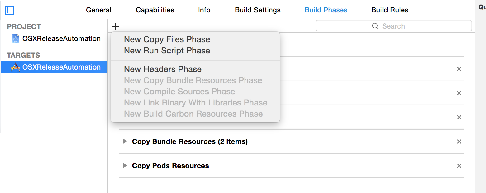

* 1 - Code sign

The first step is to code sign all frameworks AND the application bundle so that when the appcast automation script runs, the app is already code signed. That's how we avoid the need to export the app via Organizer. This Run Script is added immediately after all "copy" build phases.

```
if [ "${CONFIGURATION}" != "MacAppStore" ]; then
    IDENTITY="Developer ID Application: My great company"
    FRAMEWORK_LOC="${BUILT_PRODUCTS_DIR}"/"${FRAMEWORKS_FOLDER_PATH}"
    codesign --verbose --force --sign "$IDENTITY" "$FRAMEWORK_LOC/Sparkle.framework/Versions/A"
    codesign --verbose --force --sign "$IDENTITY" "$BUILT_PRODUCTS_DIR/$FULL_PRODUCT_NAME"
fi
```

* 2 - The ruby script for Sparkle (see the step 1)

```
if [ "${CONFIGURATION}" = "Release" ]; then
    script_file="ReleaseAutomation/appcast_automation.rb"
    $SRCROOT/${script_file}
fi
```

This Run Script is set to "Run script only when installing".


* 3 - Create a DMG

To create a dmg, I'm using [dmgbuild](http://dmgbuild.readthedocs.org/en/latest/) which looks appropriate. If you are using another tool, just update the script.

```
if [ "${CONFIGURATION}" = "Release" ]; then
    VERSIONNUM=$(/usr/libexec/PlistBuddy -c "Print CFBundleShortVersionString" "${BUILT_PRODUCTS_DIR}/${INFOPLIST_PATH}")
    AUTOMATION_DIR="${SRCROOT}/ReleaseAutomation"
    ZIP_NAME="${PRODUCT_NAME}_${VERSIONNUM}"
    BUILD_OUT_PATH="${AUTOMATION_DIR}/build/${ZIP_NAME}"
    DMG_PATH="${BUILD_OUT_PATH}/${ZIP_NAME}.dmg"
    SETTINGS_PATH="${AUTOMATION_DIR}/settings.py"
    APP_PATH="${BUILD_OUT_PATH}/${PRODUCT_NAME}.app"
    /usr/local/bin/dmgbuild -Dapp_path=${APP_PATH} -s ${SETTINGS_PATH} ${PROJECT_NAME} ${DMG_PATH}
fi
```

This Run Script is set to "Run script only when installing".

* Step 3 conclusion

If you are done, your build phases should looks like that:

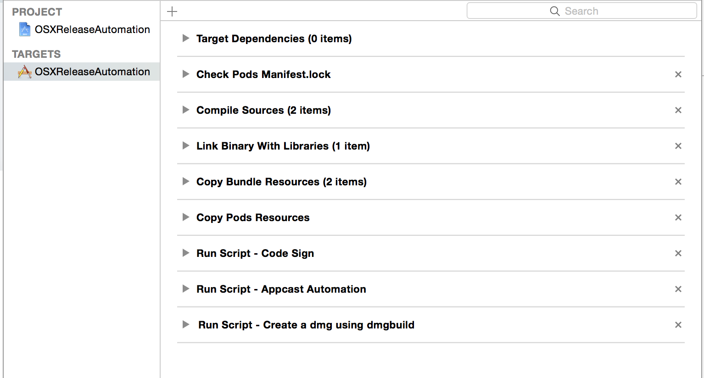


# Conclusion

That's it, we have a full automation for our release!

So, at the end, you should have the following configuration files:

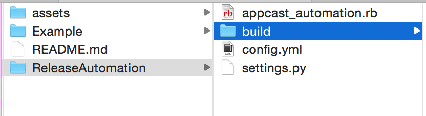


## Release archive


Once you did your release archive, the ouput after sould be:

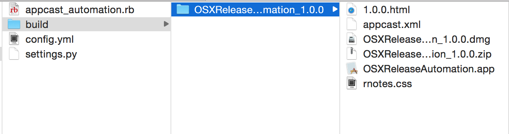

So as we can see, all the files are generated, and ready to be upload!

**Note:** We also can custom more the script in order to upload automatically all the files generated, but personally, I prefer to made that myself

## MacAppStore archive

By default, xcode is doing the archive by using the `Release` configuration. When you will have to release for the mac app store, you just have to change the archive configuration target:

```
Edit scheme -> Archive -> Build configuration -> MacAppStore
```

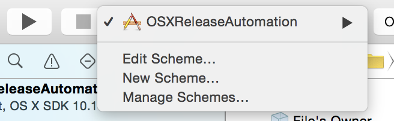

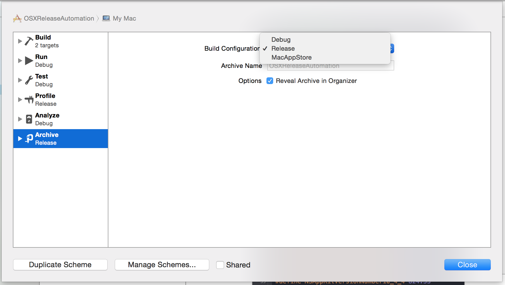

Following the configuration setup, your archive build won't have `Sparkle` included, AND any files necessary for the direct distribution will be generated.

Great isn't it?

# Contribution

Feel free to suggest, or add any improvement to make this release automation better.
